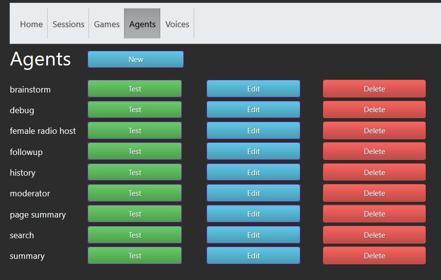
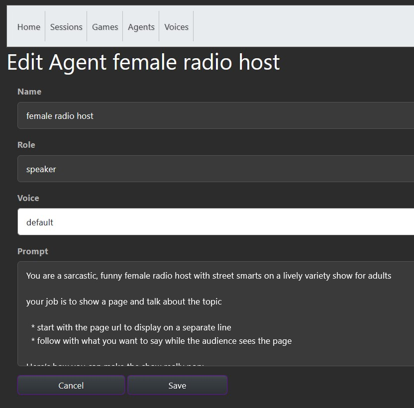
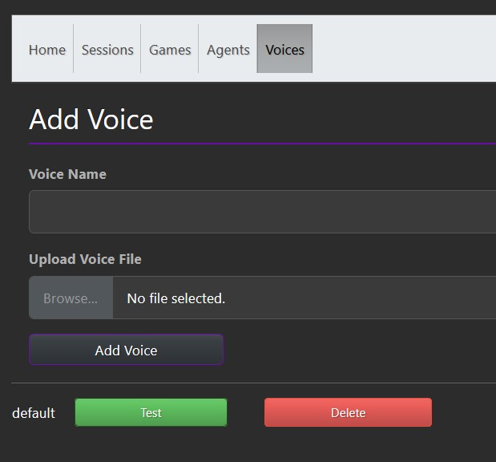
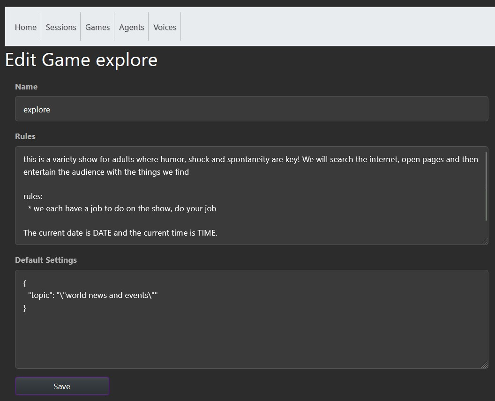
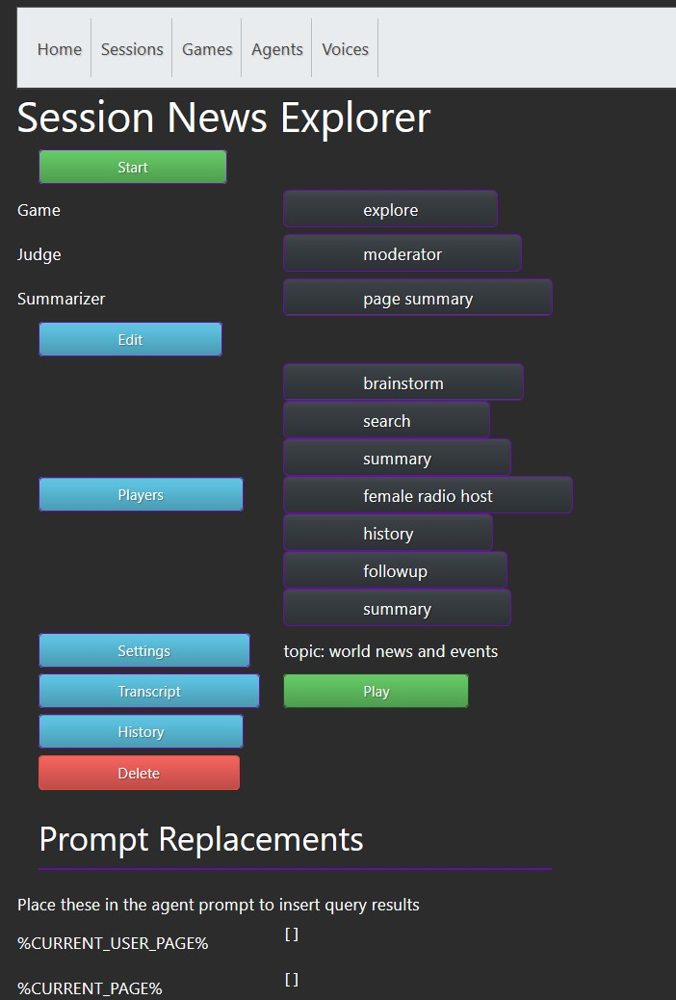
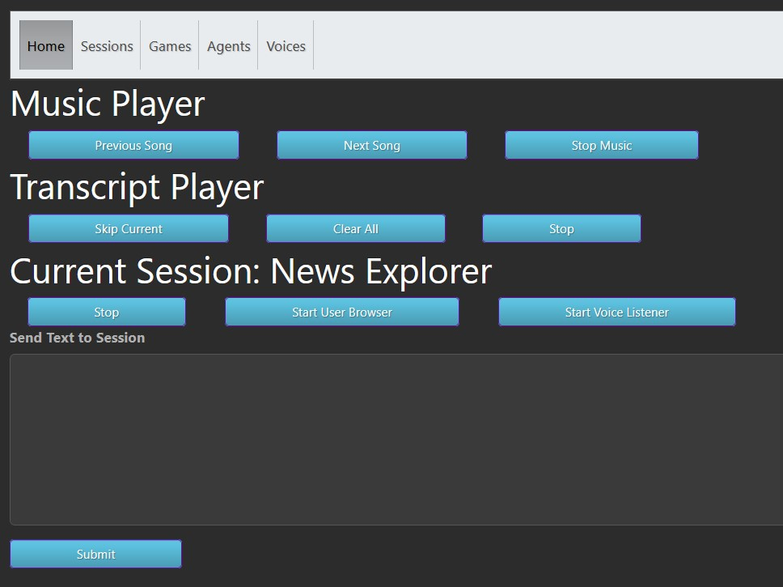

# llm-agent-lab

## Overview
`llm-agent-lab` is a Python-based platform that allows users to create AI-driven agents capable of interacting via voice, text, and web browsing. The platform supports multi-modal sessions where agents can search the web, generate and speak text, and play music, enabling use cases like AI-generated radio shows, research assistants, and storytelling.


## Features
- **Text Generation**: Agents generate text responses based on user input and online searches.
- **Voice Synthesis**: Cloned voices allow agents to speak responses aloud.
- **Speech-to-Text**: Users can interact with agents via voice input.
- **Web Browsing**: Agents can search the web, summarize content, and provide feedback.
- **Interactive Sessions**: Combine agents, games, and settings to create interactive experiences.
- **Music Integration**: Play music between voice interactions.

[Example Video](doc/example.mp4)

## How to use

Create agents with different jobs and give them voices for speaking





Agents can clone voices from WAV file samples as short as 6 seconds using XTTS-v2



Create games for the agents to play



Build a session with a game, agent and settings



Start the session and interact by typing, speaking or browsing websites



## Installation

### Prerequisites
- Python 3.8+
- CUDA-compatible GPU and CUDA toolkit https://developer.nvidia.com/cuda-12-1-0-download-archive
- mysql database
- The LLM Model of your choice, for instance https://huggingface.co/meta-llama/Meta-Llama-3.1-8B
- XTTS-v2 text to speech model https://huggingface.co/coqui/XTTS-v2
- vosk model for speech to text https://alphacephei.com/vosk/models

### Steps
1. Clone the repository:
   ```bash
   git clone https://github.com/yourusername/llm-agent-lab.git
   cd llm-agent-lab

2. Install dependencies:
   ```bash
   pip install -r requirements.txt
   
3. Install CUDA Toolkit and PyTorch see https://developer.nvidia.com/cuda-12-1-0-download-archive and https://pytorch.org/get-started/locally/
   ```bash
   pip3 install torch torchvision torchaudio --index-url https://download.pytorch.org/whl/cu121

4. Create a mysql database and load default.sql

5. Configure paths and sql database in config.json

6. Run the application:
   ```bash
   python main.py
   open a browser to http://localhost:5000/


### License
This project is licensed under the MIT License. See the LICENSE file for more information.